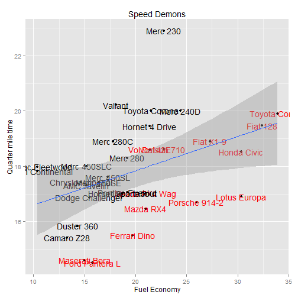

## The App: What does it do?

1. Shows the quarter mile times of various cars
2. Shows the user how this is affected by parameters such as weight, transmission type, and number of gears.
3. Gives the ability to compare rare cars that would never actually go head to head.

  Please note the data sets are currently limited, and are to be updated soon.

--- .class #id 

## Who would use it? Why would they use it?

1. Racers: to get an idea of the competition they might face.
2. Potential consumers: To understand the performance metrics of the cars listed, to assist in decision making.
3. Car enthusiasts : To compete with friends over whether Ferrari is better than Lambo (which it clearly is).
4. Data Science Students: To get an idea of how a simple app can be put together in Rstudio using Shiny.

---

## Examples of plots shown by the app

 

  Plots on the app are made using the base plotting system. A ggplot2 update is being worked on.

---

## Next Steps in Development

1. Ensure ggplot2 compatibility.
2. Update and expand dataset to provide more meaningful data.
3. Incorporate UI systems to subset certain cars to make the graphs more readable.
